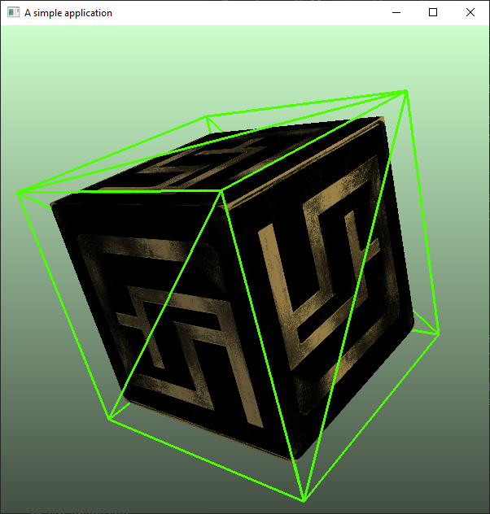

# lithium-app

This is an example application using the lithium game engine.



## Build
1. Clone this repository and enter it by running
   ```
   git clone https://github.com/filipfur/lithium-app.git
   cd lithium-app
   ```
1. Check out the lithium submodule (or update it to match what `lithium-app` expects if it is already checked out) by runnig
   ```
   git submodule update --init
   ```
1. Move to directory ```dep/lithium/dep``` and run the file ```clonealldependencies.bat```
1. Make sure you have CMake 3.22 or later installed
1. Install Visual Studio with C++ build tools (MSVC compiler).
1. Install Visual Studio Code
1. Install the extensions "C/C++" and "CMake" for VS Code.
1. Install Visual Studio Build Tools 2022, and make sure to check "Desktop development with C++"
1. Use VS or VS Code to compile the source code using the top-level CMakeLists.txt. If using VS Code, make sure you use the kit "`Visual Studio Build Tools 2022 Release - amd64`". If the kit is not visible in VS Code, choose "[Scan for kits]" and try again.

Note that some steps are platform dependent and differ if running on a unix system. The code itself is largely platform independent however, so it's completely feasible to build the software on those machines aswell.

## Troubleshooting

### Running the application

* If you run the application only to have it immediately crash and give you the error message
  ```
  PS <lithium-app-folder>\build\Debug> ."<lithium-app-folder>/build/Debug/lithium-app.exe"
  fb: 600, 600
  TinyObjReader: Cannot open file [assets/block.obj]
  ```
  then you are trying to run the application from the wrong folder. You should run the application from the root folder, so execute "`cd ../..`" in the teminal of you IDE and re-run the app.